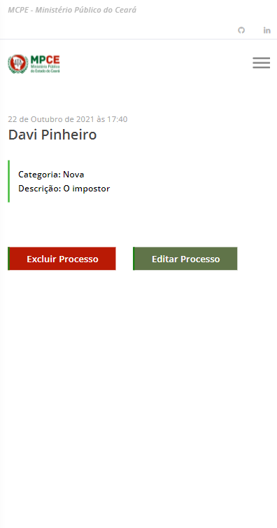

# Sistema de Visualização de Processos
<hr>

#### Autor:  Davi Segundo Pinheiro

## Deploy do Serviço na AWS:
Acesse o teste do serviço sem precisar instalar o projeto:

- Link: http://ec2-52-67-207-50.sa-east-1.compute.amazonaws.com

## Executar o Projeto via Docker:
É possível fazer o download direto da imagem via **Docker Hub** com o comando:
```sh
$ docker pull davisegundo88/django_app_mpce
```

Ou pode gerar a imagem localmente executando o comando no terminal, usando o arquivo .dockerfile que está no projeto:
```sh
$ docker build -f .\mpce.dockerfile -t davisegundo88/django_app_mpce .
```

## Executar o Projeto Localmente:

Para executar esse projeto o primeiro passo é clonar o repositório:
```sh
$ git clone https://github.com/DaviSegundo/MPCE_Test.git
```
Acesse o diretório que foi criado:
```sh
$ cd MPCE_Test
```
Em seguida podemos criar um ambiente virtual:
```sh
$ python -m venv ./venv
```
Agora para iniciar o ambiente virtual no windows:
```sh
$ .\venv\Scripts\activate
```
É preciso instalar as dependências do projeto dentro do ambiente virtual:
```sh
$ pip install -r .\requirements.txt
```
Para finalizar precisamos executar o server para conseguir ver no browser:
```sh
$ python .\manage.py runserver
```

## Funcionalidades Backend:
- Consultar.
- Cadastrar.
- Buscar.
- Excluir.
- Editar.
- Controle de Admin.

A aplicação tem persistência dos dados no Banco de dados. Para esse projeto foi utilizado o **SQLite3**.

Foi realizado um error handling para evitar problemas de criação e, também, foi implementado um sistema de retorno de mensagens informativas para descrever as ações executadas e problemas encontrados.

## Funcionalidades Frontend:
- Interface responsiva.
- Estilização para boa aparência.

Foi utilizado **Bootstrap** para acelerar o processo de estilização.
<hr>

## Telas

#### Tela Inicial:
Tela de visualização geral de processos.
<p align='center'>
    
</p>
Mostra algumas informações gerais dos processos, sendo possível acessar cada processo para ter mais detalhes.
<hr>

#### Tela de Busca:
É possível fazer busca pelo nome do processo.
<p align='center'>
    
</p>
É retornado de maneira bem generalista, com o intuito de facilitar a busca mesmo sem saber o nome exato do processo em questão.
<hr>

#### Tela do Processo:
Tela de vizualização mais específica de cada processo.
<p align='center'>
    
</p>
Nessa tela podemos editar ou excluir aquele processe que está sendo exibido.
<hr>

#### Tela de Cadastro/Editar:
Aqui é possível fazer o cadastro de um novo processo informando os dados dele ou ir a partir de um processo específico e editar os dados dele.
<p align='center'>
    
</p>
<p align='center'>
    
</p>
A categoria do processo foi criada com um select field para aparecer apenas as categorias já cadastradas.

Na tela de editar os dados do processo que está sendo mofificado já vão para os campos por default, assim facilitando a alteração só nos campos desejados.
<hr>

### Tela de Administração do Site:
<p align='center'>
    
</p>
Aqui é possível ver todos os Models registrados no site, além de ser possível observar as mudanças feitas.

#### Tela de Administração dos Processos:
Aqui temos a tela de administração dos processos, onde podemos ver alguns detalhes e gerenciar os dados.
<p align='center'>
    
</p>
Foram feitas algumas alterações para melhorar a vizualização dessa página, como a implementação de uma tabela mais informativa, uma barra de pesquisa e uma filtro por categoria.

#### Tela de Administação das Categorias:
Por aqui adicionamos as categorias possíveis que os processos podem receber.
<p align='center'>
    
</p>
<hr>

### Design Responsivo:
Demostração da responsividade das páginas.
<p align='center'>
    
    <span>.</span>
    
    <span>.</span>
    
    <span>.</span>
    
</p>
